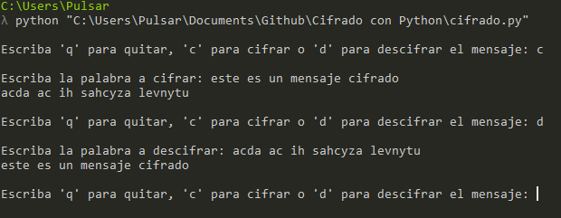

# Cifrado con Python

## Descripcion:
Cifrado y descifrado basico de mensaje con Python 3. Cada letra de la palabra o frase introducida por el usuario es intercambiada, haciendole ilegible. Para descifrar el mensaje los caracteres son cambiados por los que corresponden inicialmente.

## Vista previa

